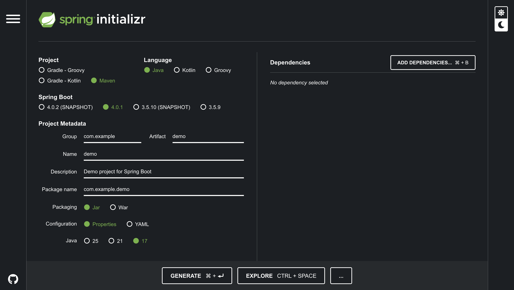

# Spring Boot Learning Journey

This repository documents my Java learning journey using the **Spring Boot** framework.

Today, I’m getting started with Spring Boot by setting up a project using **Spring Initializr**, understanding the project structure, and configuring the basics needed to build a backend application.

## What I’m learning

- Java fundamentals for backend development  
- Spring Boot framework basics  
- Creating projects with Spring Initializr  
- Understanding dependencies, configuration, and application flow  

## Tools & Stack

- Java  
- Spring Boot  
- Spring Initializr  
- Maven / Gradle  

## Screenshot

## Status

🚀 Actively learning and building small examples to strengthen my Spring Boot fundamentals.
